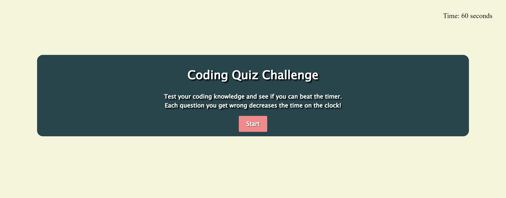

# timed-coding-quiz

## Description

I created this quiz to use as a study tool for bootcamp. I can add more questions as we continue to learn new topics in the course, and it would be a good way to reiterate important concepts. Since we do not get tested on topics in this course, I thought it would be a great way to incorporate that into my learning. I also built it as a way to practice my ability to write code in Javascript, HTML, and CSS. I learned how to write and call functions, how to notify the user after pressing a button, and install a timer and high score system into my site.

## Installation 
N/A

## Usage
To use this application, press start when the screen loads. Following that, the user will read the questions and pick their answer. If they get an answer wrong, it will decrease ten seconds off of the timer. When the quiz is over, their score is equal to the time left on the clock. The user can enter their initials and see where their score falls in the list of users who have played on that device. 

https://bcolo24.github.io/timed-coding-quiz/

## Credits
Andrew Read, TA

Youtube Quiz tutorial by Brian Design:

https://www.youtube.com/watch?v=f4fB9Xg2JEY&t=2971s

## License
MIT License

Copyright (c) 2023 bcolo24

Permission is hereby granted, free of charge, to any person obtaining a copy
of this software and associated documentation files (the "Software"), to deal
in the Software without restriction, including without limitation the rights
to use, copy, modify, merge, publish, distribute, sublicense, and/or sell
copies of the Software, and to permit persons to whom the Software is
furnished to do so, subject to the following conditions:

The above copyright notice and this permission notice shall be included in all
copies or substantial portions of the Software.

THE SOFTWARE IS PROVIDED "AS IS", WITHOUT WARRANTY OF ANY KIND, EXPRESS OR
IMPLIED, INCLUDING BUT NOT LIMITED TO THE WARRANTIES OF MERCHANTABILITY,
FITNESS FOR A PARTICULAR PURPOSE AND NONINFRINGEMENT. IN NO EVENT SHALL THE
AUTHORS OR COPYRIGHT HOLDERS BE LIABLE FOR ANY CLAIM, DAMAGES OR OTHER
LIABILITY, WHETHER IN AN ACTION OF CONTRACT, TORT OR OTHERWISE, ARISING FROM,
OUT OF OR IN CONNECTION WITH THE SOFTWARE OR THE USE OR OTHER DEALINGS IN THE
SOFTWARE.
